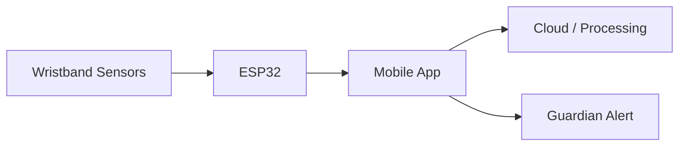

# 🚨 SAKTI BAND

### Smart Safety Wearable System (IoT + Mobile App)

> **Not just an app — a real-time life-saving system.**

---

## 🧠 Overview

SAKTI BAND is a complete IoT-based safety solution that combines a **smart wristband (ESP32)** with a **mobile application** to provide real-time emergency response, health monitoring, and location tracking.

Designed for critical situations where **every second matters.**

---

## 🎥 Demo

👉 (Add your video link here)

---

## 📸 Preview

### 🔧 Hardware + App Integration

(Add your best image here)

---

## ⚡ Key Features

* 🚨 **SOS Emergency System**
  → Hold for 3 seconds to instantly alert guardians

* 📍 **Live GPS Tracking**
  → Real-time location sharing using NEO-6M module

* ❤️ **Health Monitoring**
  → Heart Rate & SpO2 tracking

* 📡 **ESP32 + Bluetooth Communication**
  → Seamless data transfer between device & app

* 🎤 **Emergency Audio Recording**
  → Records surroundings during SOS

* 👨‍👩‍👦 **Guardian Alert System**
  → Sends alerts with live location

* 📊 **Safety Score System**
  → Analyzes user condition and risk level

---

## 🔄 How It Works



---

## 🛠 Tech Stack

* **Hardware:** ESP32, GPS (NEO-6M)
* **Mobile App:** (Flutter / React Native / Android - fill this)
* **Communication:** Bluetooth, IoT
* **Backend (if any):** (mention if used)

---

## 📁 Project Structure

```bash
app/        # Mobile application
firmware/   # ESP32 code
assets/     # Images & demo
```

---

## 🚀 Future Scope

* 🤖 AI-based danger detection
* 📡 Offline SMS emergency fallback
* ⌚ Compact wearable design (real product form)

---

## 👤 Author

**Tarun Kumar Sahu**

---

## ⭐ Support

If you found this project interesting, consider giving it a ⭐ on GitHub!
